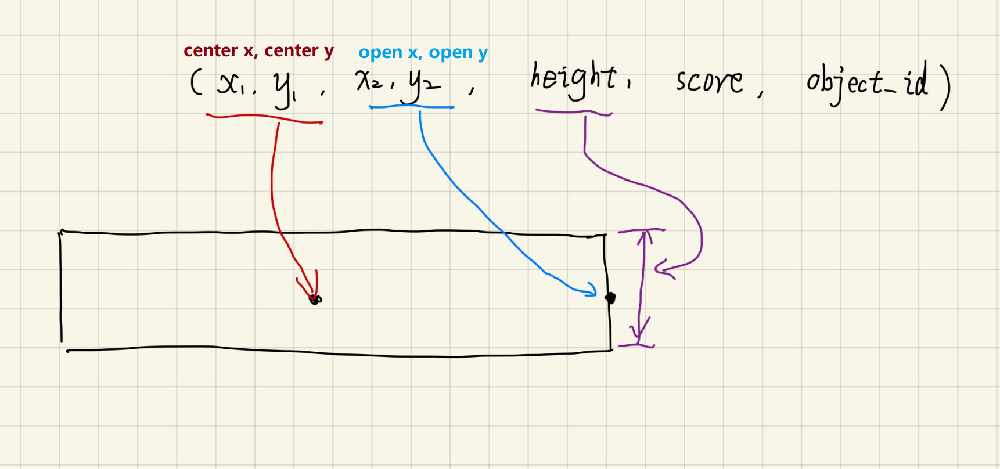
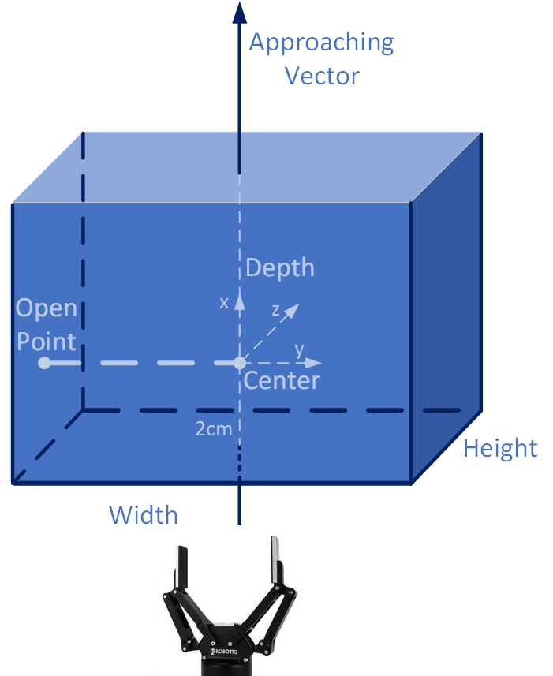

# PID-GraspNet: A Large-Scale Pointcloud-Image-Description Dataset for Robotic Grasping based on GraspNet-1Billion

@Date: 2023.7.1

@Author: [Zhi Wang(Leo TX)](https://tx-leo.github.io/)

@Email: tx.leo.wz@gmail.com

## Download our PID-GraspNet Dataset directly

coming soon...

## Acknowledgement
This dataset is generated based on [GraspNet-1Billion Dataset](graspnet.net). Thank MVIG @ STJU!

## Prepare GraspNet-1Billion Dataset First
Visit the [GraspNet Website](http://graspnet.net) to get the dataset.

Graspnet-1Billion Document:[Online Document](https://graspnetapi.readthedocs.io/en/latest/index.html), [PDF Document](https://graspnetapi.readthedocs.io/_/downloads/en/latest/pdf/)

GraspNet-1Billion Dataset structure should be: 
- graspnet
    - scene
    - models
    - dex_models
    - grasp_label
    - collision_label

## Installation
Get the code.
```bash
git clone https://github.com/TX-Leo/Text-Image-3D-Graspnet-Dataset.git
cd Text-Image-3D-Graspnet-Dataset
```
Create conda env.
```bash
conda create -n pid-graspnet
conda activate pid-graspnet
conda install python=3.8
```
Install packages(graspnetAPI).
```bash
pip install .
```

## Grasp Definition
### rect
<table>
  <tr>
    <td>
        <div align="center">
            
        </div>
    </td>
    <td>
        - score <br>
        - height <br>
        - center_point <br>
            <ul> - center_point_1 <br> </ul>
            <ul> - center_point_2 <br> </ul>
        - open_point <br>
            <ul> - open_point_1 <br> </ul>
            <ul> - open_point_2 <br> </ul>
    </td>
  </tr>
</table>

### 6d
<table>
  <tr>
    <td>
        <div align="left">
            
        </div>
    </td>
    <td>
        - score <br>
        - width <br>
        - height <br>
        - depth<br>
        - translation<br>
            <ul> - translation_1<br> </ul>
            <ul> - translation_2<br> </ul>
            <ul> - translation_3<br> </ul>
        - rotation<br>
            <ul> - rotation_1<br> </ul>
            <ul> - rotation_2<br> </ul>
            <ul> - rotation_3<br> </ul>
    </td>
  </tr>
</table>


## Generate PID-GraspNet Dataset
### Step 0.check GraspNet-1Billion Dataset
call graspnetAPI.GraspNet.checkDataCompleteness()
```bash
python generate_dataset.py --check_dataset --check_graspnet_1billion --graspnet_root 'your-graspnet-root'
```


### Step 1.generate grasp_scene_point_clouds
you can save point clouds in ".pcd" / ".npy(points)" / ".npy(points_and_colors)", take ".npy(points)" for example
```bash
python generate_dataset.py --generate_grasp_scene_point_clouds --graspnet_root 'your-graspnet-root' --camera 'kinect' --sceneId_start 0 --sceneId_end 100 --align_to_table --voxel_size 0.005 --save_npy_points
```
check if generate grasp_scene_point_clouds successfully
```bash
python generate_dataset.py --check_dataset --check_grasp_scene_point_clouds --graspnet_root 'your-graspnet-root' --camera 'kinect' --sceneId_start 0 --sceneId_end 100 
```


### Step 2.generate grasp_jsons
generate top-10 grasps in score
```bash
python generate_dataset.py --generate_grasp_jsons --graspnet_root 'your-graspnet-root' --camera 'kinect' --format '6d' --sceneId_start 0 --sceneId_end 100 --annId_start 0 --annId_end 256 --fric_coef_thresh 0.2 --no-show --specified_range_generate_grasp_jsons
```
check if generate grasp_jsons successfully
```bash
python generate_dataset.py --check_dataset --check_grasp_jsons --graspnet_root 'your-graspnet-root' --camera 'kinect' --format '6d' --sceneId_start 0 --sceneId_end 100 --annId_start 0 --annId_end 256
```


### Step 3.generate grasp_tsvs_real
You should follow the steps below (change the last parameter):

- 1.generate_grasp_tsvs_real_uncoded

- 2.generate_grasp_txt_real_uncoded

- 3.plot_grasp_txt_real_uncoded

- 4.generate_grasp_txt_real_encoded

- 5.plot_grasp_txt_real_encoded

```bash
python generate_dataset.py --generate_grasp_tsvs_real --graspnet_root 'your-graspnet-root' --train_or_test 'train' --camera 'kinect' --format '6d' --sceneId_start 0 --scene_sum 100 --sceneId_end 100 --annId_start 0 --annId_end 256 --generate_grasp_tsvs_real_uncoded
```
check if generate grasp_tsvs_real successfully
```bash
python generate_dataset.py --check_dataset --check_grasp_tsvs_real --graspnet_root 'your-graspnet-root' --camera 'kinect' --format '6d' --scene_sum 100 --sceneId_start 0 --sceneId_end 100 --annId_start 0 --annId_end 256
```


### Step 4.generate grasp_tsvs_train

```bash
python generate_dataset.py --generate_grasp_tsvs_train --graspnet_root 'your-graspnet-root' --train_or_test 'train' --camera 'kinect' --format '6d' --sceneId_start 0 --scene_sum 100 --sceneId_end 100 --annId_start 0 --annId_end 256 --specified_range_generate_grasp_tsvs_train
```
check if generate grasp_tsvs_train successfully
```bash
python generate_dataset.py --check_dataset --check_grasp_tsvs_train --graspnet_root 'your-graspnet-root' --camera 'kinect' --format '6d' --scene_sum 100 --sceneId_start 0 --sceneId_end 100 --annId_start 0 --annId_end 256
```


### Step 5.generate grasp_dataloader_config
you can modify the proportion(default: train:valid=9:1)
```bash
python generate_dataset.py --generate_grasp_dataloader_config --graspnet_root 'your-graspnet-root' --camera 'kinect' --format '6d' --sceneId_start 0 --scene_sum 100 --sceneId_end 100 --annId_start 0 --annId_end 256 --train_valid_proportion 90
```
check if generate grasp_dataloader_config successfully
```bash
python generate_dataset.py --check_dataset --check_grasp_dataloader_config --graspnet_root 'your-graspnet-root' --camera 'kinect' --format '6d' --scene_sum 100
```


### Step 6.generate grasp_tsvs_predicted
You should follow the steps below (change the last parameter):

- 1.generate_grasp_tsvs_predicted_encoded

- 2.generate_grasp_txt_predicted_encoded

- 3.plot_grasp_txt_predicted_encoded

- 4.generate_grasp_txt_predicted_uncoded

- 5.plot_grasp_txt_predicted_uncoded

```bash
python generate_dataset.py --generate_grasp_tsvs_predicted --graspnet_root 'your-graspnet-root' --train_or_test 'test' --camera 'kinect' --format '6d' --sceneId_start 0 --scene_sum 100 --sceneId_end 100 --annId_start 0 --annId_end 256 --generate_grasp_tsvs_predicted_encoded
```
check if generate grasp_tsvs_predicted successfully
```bash
to be done
```


### Step 7.generate_grasp_npys_eval
```bash
python generate_dataset.py --generate_grasp_npys_eval --graspnet_root 'your-graspnet-root' --train_or_test 'test' --camera 'kinect' --format '6d' --sceneId_start 0 --scene_sum 100 --sceneId_end 100 --annId_start 0 --annId_end 256 --specified_range_generate_grasp_npys_eval
```
check if generate grasp_npys_eval successfully
```bash
to be done
```


### Step 8.evaluation
you can:
- 1.eval_a_single_scene

- 2.eval_scenes

- 3.eval_train_dataset

- 4.eval_valid_dataset

- 5.eval_test_dataset

- 6.eval_all_data

```bash
python generate_dataset.py --eval --graspnet_root 'your-graspnet-root' --camera 'kinect' --format '6d' --sceneId_start 0 --scene_sum 100 --sceneId_end 100  --split 'test' --proc 24 --eval_a_single_scene --specified_sceneId 121
```


## PID-GraspNet Dataset Structure
- scene
    - scene_0000
    - scene_0001
      - object_id_list.txt
      - rs_wrt_kn.npy
      - kinect
          - rgb
              - 0000.png to 0255.png
          - depth
              - 0000.png to 0255.png
          - label
              - 0000.png to 0255.png
          - annotations
              - 0000.xml to 0255.xml
          - meta
              - 0000.mat to 0255.mat
          - rect
              - 0000.npy to 0255.npy
          - camK.npy
          - camera_poses.npy
          - cam0_wrt_table.npy
      - realsense
    - ....
    - scene_0189
- models
    - 000
    - 001
      - nontextured.ply
      - nontextured_simplified.ply
      - textured.jpg
      - textured.obj
      - textured.obj.mtl
      - textured.sdf
    - ....
    - 087
    - readme.txt
    - sim_mesh.mlx
    - sim_mesh.py
    - updates.txt
- dex_models
    - 000.okl
    - 001.pkl
    - ....
    - 087.pkl
- grasp_label
    - 000_labels.npz
    - 001_labels.npz
    - ....
    - 087_labels.npz
- collision_label
    - scene_0000
    - scene_0001
        - collision_labels.npz
    - ....
    - scene_0189
- grasp_scene_point_clouds
    - realsense
    - kinect
        - pcd
        - npy_points
        - npy_points_and_colors
            - 0000.npy
            - 0001.npy
            - ....
            - 0099.npy
- grasp_jsons
    - realsense
    - kinect
        - rect
            - 0000
            - 0001
                - 0000
                - 0001
                    - grasp_05_00.json(grasp_id_num.json)
                    - grasp_05_01.json
                        - rbg_img_path
                        - depth_img_path
                        - all_obj_names_and_ids_dict
                        - object_id
                        - object_name
                        - score
                        - height
                        - center_point(2)
                        - open_point(2)
                    - ....
                    - grasp_05_09.json
                    - grasp_11_00.json
                    - grasp_11_01.json
                    - ....
                - ....
                - 0255
            - ....
            - 0099
        - 6d
            - 0000
            - 0001
                - 0000
                - 0001
                    - grasp_05_00.json(grasp_id_num.json)
                    - grasp_05_01.json
                        - rbg_img_path
                        - depth_img_path
                        - all_obj_names_and_ids_dict
                        - object_id
                        - object_name
                        - score
                        - width
                        - height
                        - depth
                        - translation(3*1)
                        - rotation_matrix(3*3)
                    - ....
                    - grasp_05_09.json
                    - grasp_11_00.json
                    - grasp_11_01.json
                    - ....
                - ....
                - 0255
            - ....
            - 0099
- grasp_tsvs_real 
    - grasp_tsvs_real_kinect_rect_100
    - grasp_tsvs_real_kinect_6d_100
        - 0000
        - 0001
            - 0000
            - 0001
                - grasp_05_00.tsv(grasp_id_num.tsv)
                - grasp_05_01.tsv
                    - score
                    - width
                    - height
                    - depth
                    - translation_1
                    - translation_2
                    - translation_3
                    - rotation_1
                    - rotation_2
                    - rotation_3
                - ....
                - grasp_05_09.tsv
                - grasp_11_00.tsv
                - grasp_11_01.tsv
                - ....
            - ....
            - 0256
        - ....
        - 0099
        - all_score_uncoded.txt
        - all_width_uncoded.txt
        - all_height_uncoded.txt
        - all_depth_uncoded.txt
        - all_translation_1_uncoded.txt
        - all_translation_2_uncoded.txt
        - all_translation_3_uncoded.txt
        - all_rotation_1_uncoded.txt
        - all_rotation_2_uncoded.txt
        - all_rotation_3_uncoded.txt

        - all_score_encoded.txt
        - all_wdith_encoded.txt
        - all_height_encoded.txt
        - all_depth_encoded.txt
        - all_translation_1_encoded.txt
        - all_translation_2_encoded.txt
        - all_translation_3_encoded.txt
        - all_rotation_1_encoded.txt
        - all_rotation_2_encoded.txt
        - all_rotation_3_encoded.txt
        
        - data_num_and_sum.json

        - all_score_uncoded_distribution.png
        - all_width_uncoded_distribution.png
        - all_height_uncoded_distribution.png
        - all_depth_uncoded_distribution.png
        - all_translation_1_uncoded_distribution.png
        - all_translation_2_uncoded_distribution.png
        - all_translation_3_uncoded_distribution.png
        - all_rotation_1_uncoded_distribution.png
        - all_rotation_2_uncoded_distribution.png
        - all_rotation_3_uncoded_distribution.png
        
        - all_score_encoded_distribution.png
        - all_width_encoded_distribution.png
        - all_height_encoded_distribution.png
        - all_depth_encoded_distribution.png
        - all_translation_1_encoded_distribution.png
        - all_translation_2_encoded_distribution.png
        - all_translation_3_encoded_distribution.png
        - all_rotation_1_encoded_distribution.png
        - all_rotation_2_encoded_distribution.png
        - all_rotation_3_encoded_distribution.png
- grasp_tsvs_train
    - grasp_tsvs_train_kinect_rect_100
    - grasp_tsvs_train_kinect_6d_100
        - 0000
        - 0001
            - 0000.tsv
            - 0001.tsv
                - FLAG(19 bins)
                    - 0(no meaning)
                    - train=00(test=01)
                    - kinect=00(realsense=01)
                    - rect=01(6d=00)
                    - scene=0000-0100
                    - ann=0000-0256
                    - id=00(xx)
                    - num=00-09
                - text(select one prompt from the prompt repertory (30 prompts))
                    - scene description: all_obj_names
                    - the name of grasped object
                    - grasp info(s,w,h,d,t1,t2,t3,r1,r2,r3)
                    - example:  This is a picture of {all_obj_names}. And the {object_name} is to be grasped. The score of the grasp is {score}. The width of the grasp is {width}. The height of the grasp is {height}. The depth of the grasp is {depth}. The translation_matrix of the grasp is {translation}. The rotation_matrix is {rotation}.
                - image(base64)
                - image_width
                - image_height
                - the point cloud file path of the scene
            - ....
            - 0255.tsv
        - ....
        - 0099
- grasp_dataloder_config
    - grasp_dataloder_config_kinect_rect_100
    - grasp_dataloder_config_kinect_6d_100
        - json(train:valid=9:1)
            - train.json
            - valid.json
        - sentencepiece.bpe.model
        - dict.txt
- else
    - all_obj_names_and_ids_final.json
    - text_templates_6d_50.json
- grasp_train_output
    - grasp_train_output_kinect_rect_100
    - grasp_train_output_kinect_6d_100
        - 0000
            - model_savedir
                - checkpoint_1_5000.pt
                - checkpoint_1_10000.pt
                - checkpoint_1_15000.pt
                - checkpoint_1_20000.pt
                - checkpoint_1_25000.pt
                - checkpoint_1_30000.pt
                - checkpoint_last.pt
            - tensorboard_logdir
                - train
                    - events.out.tfevents.xxxxxxx
                - train_inner
                    - events.out.tfevents.xxxxxxx
                    - events.out.tfevents.xxxxxxx
                    - events.out.tfevents.xxxxxxx
        - 0001
        - ....
- grasp_tsvs_predicted 
    - grasp_tsvs_predicted_kinect_rect_100
    - grasp_tsvs_predicted_kinect_6d_100
        - 0000
        - 0001
            - 0000
            - 0001
                - grasp_05_00.tsv(grasp_id_num.tsv)
                - grasp_05_01.tsv
                    - score
                    - width
                    - height
                    - depth
                    - translation_1
                    - translation_2
                    - translation_3
                    - rotation_1
                    - rotation_2
                    - rotation_3
                - ....
                - grasp_05_09.tsv
                - grasp_11_00.tsv
                - grasp_11_01.tsv
                - ....
            - ....
            - 0256
        - ....
        - 0099
        - all_score_uncoded.txt
        - all_width_uncoded.txt
        - all_height_uncoded.txt
        - all_depth_uncoded.txt
        - all_translation_1_uncoded.txt
        - all_translation_2_uncoded.txt
        - all_translation_3_uncoded.txt
        - all_rotation_1_uncoded.txt
        - all_rotation_2_uncoded.txt
        - all_rotation_3_uncoded.txt

        - all_score_encoded.txt
        - all_wdith_encoded.txt
        - all_height_encoded.txt
        - all_depth_encoded.txt
        - all_translation_1_encoded.txt
        - all_translation_2_encoded.txt
        - all_translation_3_encoded.txt
        - all_rotation_1_encoded.txt
        - all_rotation_2_encoded.txt
        - all_rotation_3_encoded.txt
        
        - data_num_and_sum.json

        - all_score_uncoded_distribution.png
        - all_width_uncoded_distribution.png
        - all_height_uncoded_distribution.png
        - all_depth_uncoded_distribution.png
        - all_translation_1_uncoded_distribution.png
        - all_translation_2_uncoded_distribution.png
        - all_translation_3_uncoded_distribution.png
        - all_rotation_1_uncoded_distribution.png
        - all_rotation_2_uncoded_distribution.png
        - all_rotation_3_uncoded_distribution.png
        
        - all_score_encoded_distribution.png
        - all_width_encoded_distribution.png
        - all_height_encoded_distribution.png
        - all_depth_encoded_distribution.png
        - all_translation_1_encoded_distribution.png
        - all_translation_2_encoded_distribution.png
        - all_translation_3_encoded_distribution.png
        - all_rotation_1_encoded_distribution.png
        - all_rotation_2_encoded_distribution.png
        - all_rotation_3_encoded_distribution.png

- grasp_npys_eval
    - grasp_npys_eval_kinect_rect_100
    - grasp_npys_eval_kinect_6d_100
        - 0000-0099
            - 0000.npy-0255.npy

## Some Details About Dataset

### Rotation Matrix(3\*3) to Euler Angle(3\*1)

```Python
import transforms3d as tfs
rotation_matrix = data["rotation_matrix"] # 3*3
rotation = list(tfs.euler.mat2euler(rotation_matrix, 'sxyz')) # 3*1
```

### Adaptive Binning Encoding:KBinsDiscretizer

```Python
from sklearn.preprocessing import KBinsDiscretizer
all_score_encoded = KBinsDiscretizer(n_bins=256, encode='ordinal', strategy='quantile').fit_transform(all_score.reshape(-1, 1))
```
### Scene Description Template

```JSON
{
    "1":"This image showcases a scene with various objects, including {all_obj_names}. Among them, the object to be grasped is {object_name}. The grasp has a score of {score} and dimensions of {width}x{height}. The translation matrix for the grasp is {translation}, while the rotation matrix is {rotation}.",

    "2":"In this picture, a collection of objects is captured, comprising {all_obj_names}. The object designated for grasping is {object_name}, featuring a grasp score of {score}. The grasp exhibits a width of {width} units and a height of {height} units. The translation matrix and rotation matrix for the grasp are {translation} and {rotation}, respectively.",

    "3":"Observe this image containing several objects, namely {all_obj_names}. Our focus lies on grasping the object labeled as {object_name}, which possesses a grasp score of {score}. The dimensions of the grasp measure {width} units in width and {height} units in height. The translation matrix assigned to the grasp is {translation}, accompanied by the corresponding rotation matrix {rotation}."
}
```

### Some GraspNet Examples
```bash
cd graspnet_examples

# change the path of graspnet root

# How to load labels from graspnet.
python3 exam_loadGrasp.py

# How to convert between 6d and rectangle grasps.
python3 exam_convert.py

# Check the completeness of the data.
python3 exam_check_data.py

# you can also run other examples
```

## Change Log

### 1.0.0
- 2023.10.01
- add graspinfo and scene description to the text

### 1.0.1
- 2023.11.01
- add point clouds

### 1.1.0
- 2023.11.10
- reconstruct dataset, delete grasp_tsvs_real_encoded folder

###
- 2023.11.25
- generate grasp_train_tsvs_kinect_6d_100 and grasp_train_tsvs_kinect_rect_100

## TO DO
- check_grasp_tsvs_predicted
- check_grasp_npys_eval
- eval vis and save the final results
- test generate_grasp_tsvs_predicted
- test generate_grasp_npys_eval
- eval